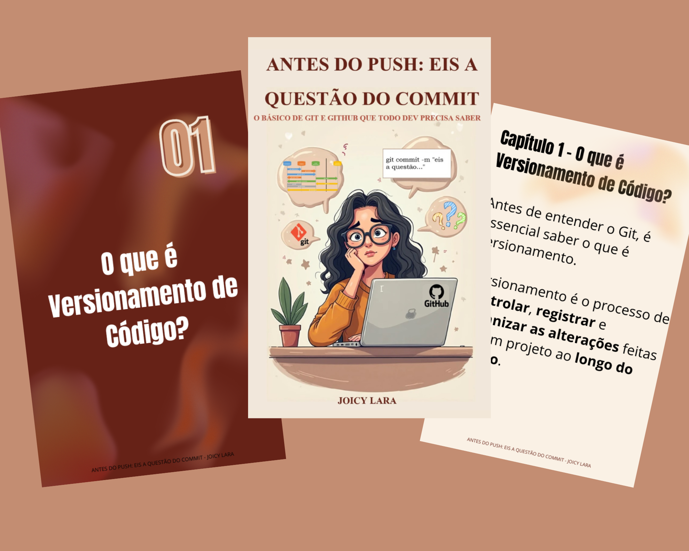

    

-------

# Projeto EBOOK Gerado por I.A.s

 > ℹ️ **NOTE:** Este é o repositório é um fork do projeto desenvolvido durante o curso de Introdução a Engenharia de Prompts da [DIO](https://dio.me)

Projeto com o objetivo de gerar um ebook digital com as facilidades das ferramentas de IA. todos os prompts
seguem abaixo.

<a href="prompts-recipe-to-create-a-ebook\output\Ebook - DIO projeto de desafio.pdf" title="View PDF now"> 📕Clique aqui para ler</a>

## 💻 Tecnologias utilizadas no projeto

- [ChatGPT](https://chat.openai.com/) 
- [Leonardo IA](https://leonardo.ai/)
- [Canva](https://www.canva.com/)

## 🧠 Prompts

ChatGPT：

|   Ação   | prompt                                                                                                                                                                                                                                                                         |
| :------: | ------------------------------------------------------------------------------------------------------------------------------------------------------------------------------------------------------------------------------------------------------------------------------ |
|  título  | Crie um título de um ebool sobre o tema de git e gitHub, o ebook é do nicho de versionamento de código e subnicho é de repositório, dentro do mundo da programação. O título deve ser épico, curto e criativo, e tenha uma temática mais nerd. Liste 5 variações de título. faça um título mais leve, engraçado, fácil de entender, se possível com trocadilhos                                                |
| conteúdo | Faça um texto para ebook, com foco em git e GitHub, listando os principais conceitos que os dev's, usuários, do git e github devem saber antes de usar. Com exemplos dos comandos (REGRAS): 
- Explique sempre de uma maneira simples, de fácil entendimento
- Deixe o texto enxuto
- Sempre traga exemplos de comandos com contexto real que normalmente os dev's enfrentam
- Sempre deixe um título sugestivo por tópico
- Ao explicar os conceitos tente associar a análogias 
- Ao longo do ebook, ao elaborar os tópicos sempre siga uma lógica para compreensão

## 🧠 Prompts para gerar as imagens
Leornado IA：

|  Ação  | prompt                                                                                 |
| :----: | -------------------------------------------------------------------------------------- |
| Capa principal | A clever and lighthearted digital illustration of a young Brazilian female programmer with long, wavy hair and glasses, sitting at a clean and modern desk, facing forward. She has a thoughtful, slightly confused expression as she looks at her laptop screen. On the screen, the terminal shows: git commit -m "não sei o que commitar". Around her, subtle Git and GitHub visuals: commit nodes, branch lines, GitHub logo (Octocat) on a sticker or screen. The scene reflects the theme: “Eis a Questão: Git e a Arte de Não Saber o Que Escrever no Commit”..1 |
Imagem que representa o ciclo do commit | A 3-step cartoon-style digital illustration that visually explains Git using a package metaphor. Step 1: A person carefully places items (representing files) into a cardboard box — this step is labeled “git add”. Step 2: The same person puts a shipping label with a name on the box — this step is labeled “git commit”. Step 3: The person hands the sealed, labeled box to a mail carrier or places it into a mailbox with the GitHub logo — this step is labeled “git push”. The scene should be colorful, fun, and educational, with each step shown from left to right. Transparent or white background. |

## ✨ Features

- Conteúdo gerado via ChatGPT
- Imagens geradas via Leornado IA

## 📚 Materiais

- Imagens utilizadas em `assets`
- ebook gerado durante as aulas em `output`

## 🛠️ Instruções de execução

Utilize os prompts acima nas ferramentas sugeridas para gerar o material base e utilize uma ferramenta de edição de documentos como power point, libreoffice, canva, indesign para diagramação.

## 👨‍💻 Autores

    
&nbsp&nbsp&nbspJoicy Lara 
    &nbsp&nbsp&nbsp
    <a href="https://github.com/Joicylara">
    GitHub</a>&nbsp;|&nbsp;
    <a href="https://www.linkedin.com/in/joicy-kelly-dev/">LinkedIn</a>
&nbsp;
&nbsp;|&nbsp;

  

    
&nbsp&nbsp&nbspChatGPT 
    &nbsp&nbsp&nbsp
    <a href="https://chatgpt.com/">
    ChatGPT</a>&nbsp;

---
